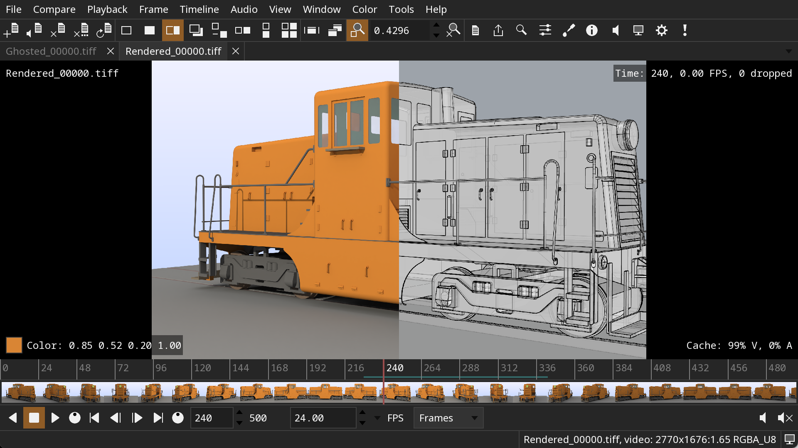

DJV
===
DJV provides professional review software for VFX, animation, and film production.
Playback high resolution, high bit-depth, image sequences and videos, with frame
accurate control and color management. Available for Linux, Apple macOS, and
Microsoft Windows. Source code is provided under a BSD style open source license.

* [Download](https://darbyjohnston.github.io/DJV/download.html)
* [Contribute](https://darbyjohnston.github.io/DJV/contributing.html)
* [Documentation](https://darbyjohnston.github.io/DJV/documentation.html)

Building the Code
-----------------

* [Building on Linux](https://darbyjohnston.github.io/DJV/build_linux.html)
* [Building on macOS](https://darbyjohnston.github.io/DJV/build_macos.html)
* [Building on Windows](https://darbyjohnston.github.io/DJV/build_windows.html)

License
-------

DJV is released under a BSD style open source license, see this
[page](https://darbyjohnston.github.io/DJV/legal.html) for details.

Contributing
------------

See this [page](https://darbyjohnston.github.io/DJV/contributing.html) for information on contributing to DJV.
